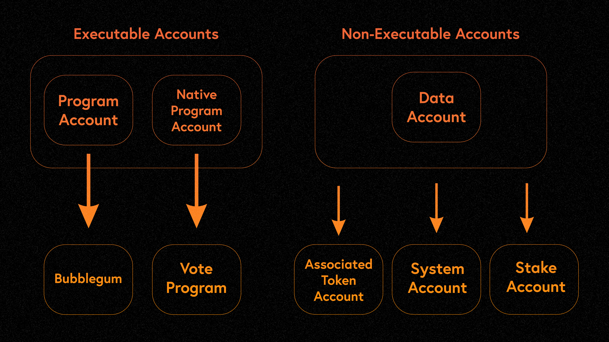

# Accounts

Everything on solana is an account, accounts are container that hold data persistently much like computer's files

## Types of Accounts
- Account that store data (Data Account)
- Account that store executable programs
- Account that store native programs



## Account structure in Rust 🦀
```rust 
pub struct AccountInfo<'a> {
    pub key: &'a Pubkey,
    pub lamports: Rc>,
    pub data: Rc>,
    pub owner: &'a Pubkey,
    pub rent_epoch: Epoch,
    pub is_signer: bool,
    pub is_writable: bool,
    pub executable: bool,
}
```

!Accounts can be reused!!

## Programs
Programs are executable accounts owned by the BPF Loader, they are executed by solana runtime,
Programs are stateless in solana, which means they do not store any internal state, instead
all the data they needed is stored in another account which is passed to them (programs) by reference
via a transaction, this allows for a single generic deployment to interact with different accounts

Programs in solana have the capacity to
- own additional accounts
- read from or credit other accounts
- modify or debit the accounts they own

Types of programs
- On-Chain Programs: User written programs that are deployed on solana
- Native Programs: These are programs integrated into the core of solana, they provide functionalities needed for validators to operate

Both on-chain programs and native programs can be called users and other programs, the main distinction is their upgrade mechanism
on-chain can be upgraded by their upgrade authority, while native are upgrade through system wide cluster upgrade

Programs development in solana is primary done in Rust with the help of the anchor framework
Programs are usually developed and tested against localhost and devnet before being deployed
Deployed programs live in accounts marked as executable with their account address serving as the program id 


## Transactions
Transaction are the mechanism through which programs are invoked and state change is handled, a transaction is a set of instructino
which tells the validator what actions should be perform on which accounts and the permissions needed to perform said actions

a transaction consist of 3 parts
- an array of accounts to read or write to 
- one or more instructions
- one or more signatures

Transaction follow the transactino struct

```rust
pub struct Transaction {
    pub signatures: Vec,
    pub message: Message,
}

```

The message follows the struct

```rust 

pub struct Message {
    pub header: MessageHeader,
    pub account_keys: Vec,
    pub recent_blockhash: Hash,
    pub instructions: Vec,
}

```


# Instruction
an instruction is a directive for a single invocation of a solana program 

```rust 
pub struct Instruction {
    pub program_id: Pubkey,
    pub accounts: Vec,
    pub data: Vec,
}
```